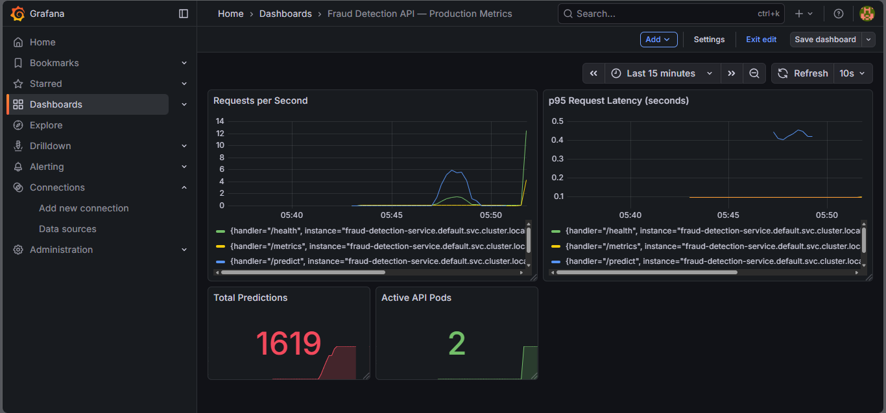

# Real-Time Fraud Detection MLOps Platform on Kubernetes


A production-style end-to-end MLOps platform for detecting fraudulent financial transactions in real time.

The system combines an optimized XGBoost model, FastAPI inference serving, Kafka-based event streaming, Redis caching, PostgreSQL persistence, Prometheus/Grafana observability, MLflow experiment tracking, and Kubernetes autoscaling.

Built and deployed completely locally on Minikube using an Intel i5 CPU-only machine, demonstrating cloud-native ML engineering practices under real hardware constraints.

## Highlights

- Real-time fraud prediction API using FastAPI + XGBoost
- Event-driven transaction pipeline with Apache Kafka
- Kubernetes deployment with Horizontal Pod Autoscaling
- Prometheus + Grafana production monitoring
- MLflow experiment tracking
- Redis caching layer
- PostgreSQL prediction audit storage
- Data drift monitoring pipeline
- SHAP-based model explainability

## Architecture

```text
Locust Load Test
      ↓
K8s NodePort Service (port 30080)
      ↓
HPA (auto-scales 1→3 pods at 70% CPU threshold)
      ↓
fraud-detection-api pods (FastAPI + XGBoost + SHAP)
      ↓                              ↓
Prometheus + Grafana          Kafka Consumer
(observability)                     ↓
                         Redis (cache) + PostgreSQL (persistence)
                                    ↑
                            Kafka Producer
                       (synthetic transactions)
```

## Demo

### HPA Scaling in Action

*CPU hit 119% → Kubernetes HPA automatically scaled from 1 to 2 pods*

### Grafana Observability Dashboard

*Live metrics: 1619 total predictions, requests/sec spike during load test, Active API Pods = 2*

## Tech Stack

| Layer | Technology | Purpose |
|---|---|---|
| **Model Training** | XGBoost, Optuna, scikit-learn | Tabular fraud modeling with hyperparameter tuning |
| **Inference Serving** | FastAPI, Uvicorn, Pydantic | Async REST API with per-request SHAP explainability |
| **Streaming** | Apache Kafka, kafka-python | Real-time transaction ingestion pipeline |
| **Caching** | Redis | Sub-millisecond result caching with 1hr TTL |
| **Persistence** | PostgreSQL | Fraud prediction audit log |
| **Containerization** | Docker (multi-stage) | Production-grade image with non-root user |
| **Orchestration** | Kubernetes, Minikube | Container orchestration with rolling updates |
| **Autoscaling** | K8s HPA | CPU-based pod scaling (threshold: 70%) |
| **Observability** | Prometheus, Grafana | Live metrics dashboard |
| **Load Testing** | Locust | Concurrent user simulation with HTML reports |
| **Drift Monitoring** | Custom (Evidently-style) | Statistical drift detection with HTML report |
| **CI/CD** | GitHub Actions | Manifest validation, Dockerfile linting |
| **Experiment Tracking** | MLflow | Hyperparameter and metric logging |

## Model Performance

| Metric | Value |
|---|---|
| **ROC-AUC** | 0.9687 |
| **F1 Score** | 0.7718 |
| **Precision** | — |
| **Recall** | — |
| **Optuna Trials** | 30 |
| **Training Dataset** | IEEE-CIS Fraud Detection (590,540 transactions) |
| **Best Hyperparameters** | n_estimators=421, max_depth=8, learning_rate=0.204, scale_pos_weight=3.52 |

## Load Test Results

| Metric | Value |
|---|---|
| **Concurrent Users** | 10 |
| **Total Requests** | 606 |
| **Failure Rate** | 0% |
| **p50 Latency** | 120ms |
| **p95 Latency** | 590ms |
| **p99 Latency** | 1700ms |
| **Peak CPU** | 119% |
| **HPA Scale Event** | 1 → 2 pods at 119% CPU |

> Latency is low in this run because HPA scaled to 2 pods, distributing inference load. Per-request SHAP computation is CPU-bound — latency increases under single-pod load.

## Observability

Prometheus scrapes four targets:
- `fraud-detection-api` — request metrics, latency histograms
- `kube-state-metrics` — deployment replica counts
- `node-exporter` — node CPU and memory
- `prometheus` — self-monitoring

Grafana dashboard panels:
- Requests per Second (by handler)
- p95 Request Latency
- Total Predictions served
- Active API Pods (from kube-state-metrics)

## Project Structure

```text
fraud-detection-k8s/
├── app/
│   └── main.py                    # FastAPI inference service
├── model/
│   ├── train.py                   # XGBoost training pipeline
│   ├── feature_columns.json       # Ordered feature list
│   ├── feature_importance.json    # SHAP top 10 features
│   ├── preprocessing_info.json    # Medians and column types
│   └── confusion_matrix.png       # Training evaluation plot
├── streaming/
│   ├── producer.py                # Kafka synthetic transaction producer
│   └── consumer.py                # Kafka consumer → Redis + PostgreSQL
├── monitoring/
│   ├── drift_check.py             # Statistical drift detection
│   ├── drift_report.html          # Drift HTML report
│   ├── drift_summary.json         # Drift JSON summary
│   ├── grafana_dashboard.json     # Importable Grafana dashboard
│   └── prometheus-scrape-config.yaml
├── k8s/
│   ├── deployment.yaml            # 1 replica, rolling update, probes
│   ├── service.yaml               # NodePort on 30080
│   ├── configmap.yaml             # Externalized configuration
│   ├── hpa.yaml                   # CPU autoscaling 1-3 pods
│   └── ingress.yaml               # Nginx ingress for fraud-detection.local
├── load_test/
│   ├── locustfile.py              # Load test with legitimate + fraud traffic
│   ├── load_test_report.html      # Locust HTML report
│   └── test_results.png           # HPA scaling screenshot
├── scripts/
│   ├── deploy.ps1                 # Full cluster deployment script
│   └── teardown.ps1               # Clean cluster teardown
├── .github/
│   └── workflows/
│       └── ci.yml                 # Manifest validation + lint
├── Dockerfile                     # Multi-stage, python:3.11-slim
└── requirements.txt               # Pinned inference dependencies
```

## Quick Start

### Prerequisites
- Docker Desktop
- Minikube v1.38+
- kubectl v1.34+
- Helm v4+
- Python 3.11

### 1. Clone and setup
```bash
git clone https://github.com/anantha037/fraud-detection-k8s.git
cd fraud-detection-k8s
python -m venv venv
venv\Scripts\activate   # Windows
pip install -r requirements.txt
pip install xgboost optuna mlflow shap scikit-learn pandas joblib matplotlib
```

### 2. Download dataset
Download `train_transaction.csv` from [IEEE-CIS Fraud Detection](https://www.kaggle.com/c/ieee-fraud-detection/data) and place at `model/train_transaction.csv`

### 3. Train model
```bash
python model/train.py
```
Training takes ~30 minutes. Outputs: `fraud_model.pkl`, `label_encoders.pkl`, `preprocessing_info.json`, `feature_columns.json`

### 4. Build Docker image
```bash
docker build -t fraud-detection-api:latest .
```

### 5. Deploy to Kubernetes
```powershell
powershell -ExecutionPolicy Bypass -File scripts/deploy.ps1
```
This starts minikube, enables addons, deploys Kafka/Redis/PostgreSQL/Prometheus/Grafana via Helm, applies all K8s manifests, and waits for rollout.

### 6. Access the API
```powershell
kubectl port-forward service/fraud-detection-service 8080:80
curl http://127.0.0.1:8080/health
```

### 7. Test a prediction
```bash
curl -X POST http://127.0.0.1:8080/predict \
  -H "Content-Type: application/json" \
  -d '{"transaction_id":"test-001","TransactionAmt":4500.0,"ProductCD":"C","card4":"visa","card6":"credit","P_emaildomain":"anonymous.com"}'
```

### 8. Access Grafana
```powershell
kubectl port-forward service/grafana 3001:80
```
Open `http://127.0.0.1:3001` — login: `admin` / `admin123`

Import `monitoring/grafana_dashboard.json` for the pre-built dashboard.

### 9. Run load test
```bash
venv\Scripts\activate
cd load_test
locust -f locustfile.py --headless --users 10 --spawn-rate 2 --run-time 90s --host http://127.0.0.1:8080 --html load_test_report.html
```

Watch HPA scale in real time:
```bash
kubectl get hpa -w
```

### 10. Drift monitoring
```bash
python monitoring/drift_check.py
```

## Key Engineering Decisions

- **XGBoost over Deep Learning** — Tabular financial data with class imbalance responds better to gradient boosting. XGBoost with `scale_pos_weight` handles the 3.5% fraud rate effectively. No GPU needed.
- **Per-request SHAP** — Every prediction returns the top 5 contributing features. Fraud explainability is a regulatory requirement in production fintech systems.
- **Multi-stage Dockerfile** — Builder stage installs all dependencies; runtime stage copies only what inference needs. Keeps the image clean and reduces attack surface.
- **Minikube over cloud K8s** — Zero cost, fully reproducible locally. Same manifests deploy unchanged to EKS or GKE.
- **kafka-python over Confluent** — Avoids SASL authentication complexity for local development. Producer/consumer pattern is identical in production.
- **kubectl pods for Kafka/PostgreSQL** — Bitnami charts for Kafka and PostgreSQL require paid image subscriptions since August 2025. Official Apache Kafka and PostgreSQL images are used directly.

## Hardware Constraints

Everything runs on:
- **CPU:** Intel i5-8250U (4 cores, 8 threads)
- **RAM:** 8GB
- **GPU:** None
- **OS:** Windows 11
- **Minikube:** 4096MB RAM, 2 CPUs

## Author

**Anantha Krishnan K** — AI/ML Engineer  
- **GitHub:** [anantha037](https://github.com/anantha037)
- **HuggingFace:** [ananthan7703](https://huggingface.co/ananthan7703)
- **LexShield AI:** [lexshield.co.in](https://lexshield.co.in)
