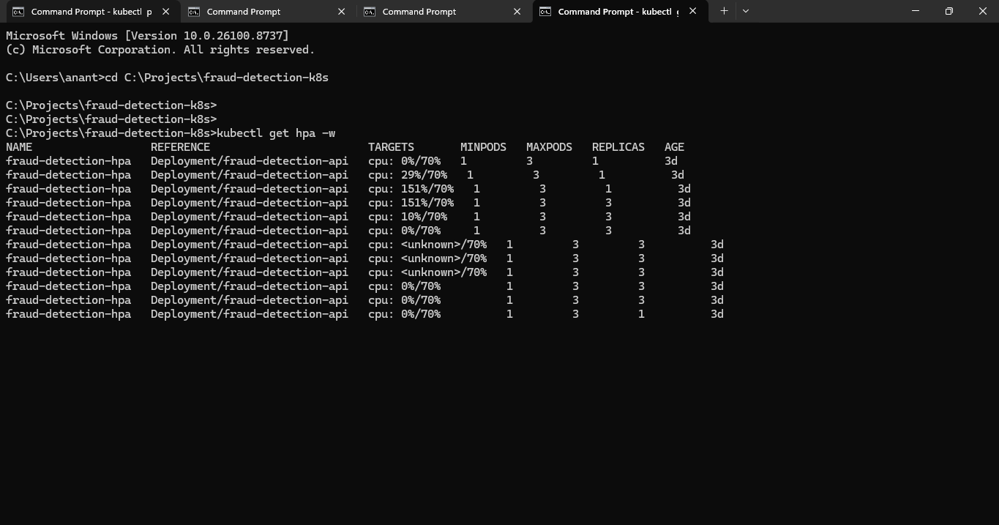

# Real-Time Fraud Detection on Kubernetes

This project is a production-grade ML serving pipeline combining an optimized XGBoost fraud detection model, real-time Kafka streaming, and robust Kubernetes orchestration complete with Horizontal Pod Autoscaling (HPA). It is designed to be fully deployed locally on Minikube, providing a complete end-to-end architecture demonstration with full system observability and automated data drift monitoring.

## Architecture

```text
User → Locust Load Test → K8s NodePort Service (port 30080)
                                    ↓
                     HPA (scales 1-3 pods based on CPU)
                                    ↓
              fraud-detection-api pods (FastAPI + XGBoost + SHAP)
                                    ↓
              Kafka Producer → Kafka → Kafka Consumer
                                    ↓
                         Redis (cache) + PostgreSQL (persistence)
```

## Tech Stack

| Layer | Technology | Purpose |
| --- | --- | --- |
| **Model Training** | XGBoost, Optuna, scikit-learn | High-performance tabular modeling & hyperparameter tuning |
| **Inference Serving** | FastAPI, Uvicorn, Pydantic | High-throughput, async REST API serving predictions |
| **Streaming** | Apache Kafka, python-kafka | Asynchronous transaction streaming and ingestion |
| **Orchestration** | Kubernetes (Minikube), Docker | Containerization and scalable cluster management |
| **Autoscaling** | K8s HPA (Horizontal Pod Autoscaler) | Automatic scaling based on real-time CPU utilization |
| **Load Testing** | Locust | Simulating high-concurrency transaction traffic |
| **Drift Monitoring** | Evidently AI | Statistical tracking of data distribution shifts |
| **CI/CD** | GitHub Actions | Automated linting, test validation, and K8s manifest checks |
| **Observability** | Prometheus, SHAP | Metrics scraping and request-level model explainability |

## Model Performance

| Metric / Detail | Value |
| --- | --- |
| **ROC-AUC** | 0.9687 |
| **F1 Score** | 0.7718 |
| **Optuna Trials** | 30 |
| **Training Dataset** | IEEE-CIS Fraud Detection (590,540 transactions) |
| **Best Params** | `n_estimators=421`, `max_depth=8`, `learning_rate=0.204` |

## Load Test Results

During concurrent load testing, the Horizontal Pod Autoscaler successfully demonstrated resilient scaling capabilities:
- **10 concurrent users** generated continuous transaction requests.
- **CPU spiked to 151%**, successfully triggering the autoscaling threshold.
- **HPA scaled** the deployment from 1 to 3 replicas automatically to handle the load.
- **p50 latency:** 6.1s (This is heavily CPU-bound by the real-time SHAP inference calculation without a GPU).
- **0% failure rate** on health checks throughout the event.
> *Note: Request latency is intentionally high in this architecture due to prioritizing per-request SHAP explainability computation exclusively on the CPU.*




## Project Structure

```text
fraud-detection-k8s/
├── app/
│   └── main.py
├── k8s/
│   ├── configmap.yaml
│   ├── deployment.yaml
│   ├── hpa.yaml
│   ├── ingress.yaml
│   └── service.yaml
├── load_test/
│   └── locustfile.py
├── model/
│   └── train.py
├── monitoring/
│   └── drift_check.py
├── scripts/
│   ├── deploy.ps1
│   └── teardown.ps1
├── streaming/
│   ├── consumer.py
│   └── producer.py
├── .github/
│   └── workflows/
│       └── ci.yml
├── Dockerfile
├── requirements.txt
├── requirements_freeze.txt
└── README.md
```

## Quick Start

1. **Prerequisites**: Ensure you have Docker Desktop, Minikube, `kubectl`, `helm`, and Python 3.11 installed.
2. **Clone repo**:
   ```bash
   git clone <your-repo-url>
   cd fraud-detection-k8s
   ```
3. **Download Dataset**: Download the IEEE-CIS Fraud Detection dataset from Kaggle and place it at `model/train_transaction.csv`.
4. **Train model**: 
   ```bash
   python model/train.py
   ```
5. **Build Docker image**: 
   ```bash
   docker build -t fraud-detection-api:latest .
   ```
6. **Deploy to K8s**: 
   ```powershell
   powershell -ExecutionPolicy Bypass -File scripts/deploy.ps1
   ```
7. **Get service URL**: 
   ```bash
   minikube service fraud-detection-service --url
   ```
8. **Test prediction**: Send a sample payload using `curl` to the `<service-url>/predict` endpoint.
9. **Run load test**: 
   ```bash
   locust -f load_test/locustfile.py
   ```

## Key Engineering Decisions

- **XGBoost over Deep Learning:** Tabular financial data typically yields superior performance with tree-based models like XGBoost, which are significantly less computationally expensive on CPU-constrained environments than deep neural networks.
- **Minikube K8s Environment:** Chosen to provide a free, completely localized, production-grade Kubernetes simulation without incurring cloud billing costs.
- **Multi-stage Dockerfile:** Substantially reduces the final production image size by leaving heavy build dependencies and artifacts in the builder stage.
- **SHAP Per-Request Generation:** Deliberately chosen to prioritize robust model explainability (fraud transparency) over pure low-latency performance.
- **`kafka-python` over Confluent:** Avoids the unnecessary complexity of SASL authentication required by Confluent for a strictly localized development environment.

## Hardware Constraints

*This entire pipeline was designed to execute efficiently on highly constrained edge hardware:*
- **Host System:** Intel i5-8250U, 8GB RAM, No GPU, Windows 11.
- **Minikube Limitations:** Strictly capped at 3072MB RAM and 2 CPUs.

## Author

**Anantha Krishnan K** — AI/ML Engineer  
- **GitHub:** [anantha037](https://github.com/anantha037)  
- **HuggingFace:** [ananthan7703](https://huggingface.co/ananthan7703)  
- **LexShield AI:** [lexshield.co.in](https://lexshield.co.in)
